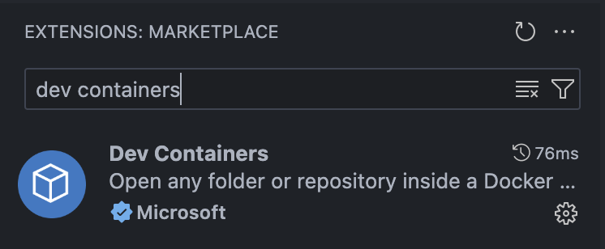
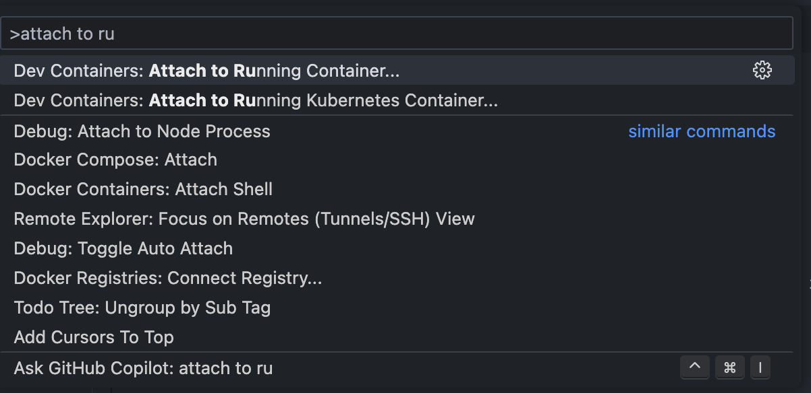

# Setup Containers with VSCode

This will allow you to access and edit files easier.

## Step 1

Install the Dev Containers extension from the extensions menu in VSCode.

## Step 2

Now we need to attach vscode to running container. 

Using the Command menu (MacOS: Cmd + Shift + P  Linux/Windows: Ctrl + Shift + P), type in `attach to running container`

Here select `/ros2`.

Now allow VSCode some time as it installs it self in the container.

When you see the new window appear, click open directory and choose `/home/student`

Now you can just work in VSCode.

> [!NOTE]
> You can check the bottom left corner of the VSCode window to see if you have it working properly!

## Bonus Tip:

Use the vscode terminals to avoid having to type `ros_shell`